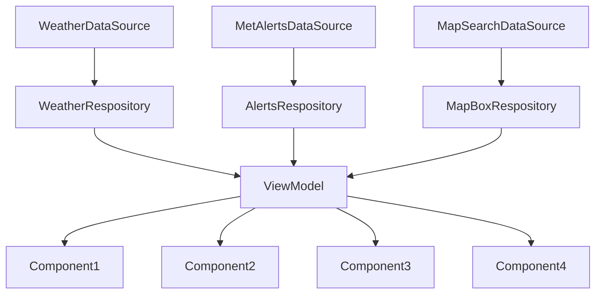

Beskriver arkitekturen som er benyttet i appen.

Beskrivelse av hvordan viktige objektorienterte prinsipper som
lav kobling og høy kohesjon samt design patterns som MVVM
og UDF er ivaretatt i løsningen burde også være med.

Beskriv løsningen beregnet på lesere som skal jobbe med drift,
vedlikehold og videreutvikling av løsningen. Beskriv hvilke
teknologier og arkitektur som brukes i løsningen. Beskriv hvilket
API-nivå (Android versjon) dere har valgt, og hvorfor.

# ARCHITECTURE.MD Weather Pawcast
### ARCHITECTURE.md is a file where information about the architecture, build and methods in the project/code. There will also be information about the object-oriantated principples, API-level chosen and how other developers can further develop and use the code.

## ARCHITECTURE: 
### Datasource and Respositories:
We are using API calls from a JSON source from MetAlerts and MapBox. Theese are collected in DataSources. Later the data is collected by the DataRespositories where using Interfaces we develop functions that collect the data and later sort them into  the Data Classes. Theese respositories is where the data is called and used by the viewmodel. 

### ViewModel
In our App we are using a viewmodel to handle data. A ViewModel is a livedata class that calls on the respositories and and save them in a UI-state. Then we can handle and use the data as we want, while the UI-state handles where and what is done so the Data will update live. This means that instead of loading in the page every time, the page is saved/remembered. An example is when you set your location in the App, if you then change screen and then back the location will NOT reset, it is saved.

### Object-Orientated
In our code we are using Data classes to create objects to save and use the data from the APIs. This is created in the DataSource, collected in the This way obejct oriented principples are used on a good level to create a good fucntioning code

### API-level
We choose to use API-level 34. This was due to us wanting a App that was as new and modern as possible. There is however more modern levels, but API 34 was something we were comfortable on. We all have worked on level 34 in the Mandatory Tasks earlier in the semester, therefore 34 was a good level that was both modern, but also something we knew and had worked with.

### Further development
