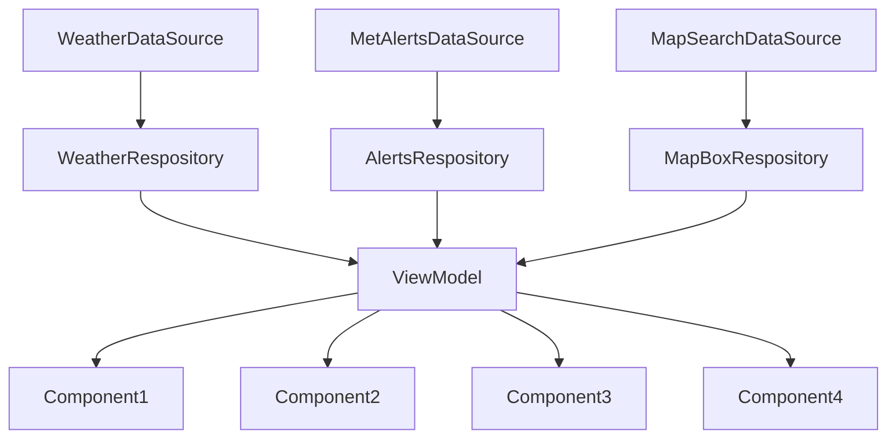

# ARCHITECTURE.MD Weather Pawcast
### ARCHITECTURE.md is a file containing information about the architecture, build and methods in the project/code. There will also be information about object-oriented principles and the chosen API-level.

## ARCHITECTURE:

## ARCHITECTURE Model


The model diagram provided is a simplified architectural representation of the weather application, highlighting key components and their relationships.

1. **Main Components and Flow**:
   - **MainActivity** acts as the main entry point, directing to various screens like **AlertScreen**, **HomeScreen**, **InformationScreen**, and **SettingsScreen**.
   - **WeatherScreen** and **WeatherViewModel** are central to handling weather-related functionalities. **WeatherViewModel** aggregates data from **MetAlertsRepository** and **LocationForecastRepository** to provide the weather and alert data.
   - **MetAlertsRepository** and **LocationForecastRepository** fetch data from respective **DataSources**, which further interact with APIs to retrieve **MetAlertData** and **LocationForecastData**.


The diagram simplifies the application's architecture by focusing on major functionalities and components like data fetching, view model operations, and UI interactions. It omits deeper details of lower-level operations or secondary UI components, focusing instead on how the main components interact and depend on each other.

For a more detailed understanding of data classes and finer architectural details, the model refers to the `MODELLING.md` file. This file in the github repo includes more comprehensive modelling and information about the app, with for example class diagrams and sequence diagrams.

This representation is streamlined to aid quick understanding and efficient overview without too much detail.

#### Design Patterns
We have tried to adhere to the MVVM design pattern (Model View Viewmodel) in the development of our application. This is the design pattern that is also recommended by Google for developing apps for the Android platform. In brief, MVVM is a design pattern that helps us separate the underlying application logic from the graphical user interface. One can say that it consists in separating the app in three parts: the model, the view and the viewmodel. The view is what is actually shown on the screen. The model is the part that contains the data: data sources and repositories. The viewmodel can be said to be the bridge between the view and the model. It is responsible for receiving the data from the model, making relevant data ready for display by the view layer. 
In our application we have tried to separate these three layers. In our application code, we have a data-package (responsible for the data of the application. It contains the data sources and repositories, a ui-package, which contains the code for the graphical user interface, and a viewmodel package, which contains the code for the view model.

We have also attempted to adhere to the UDF design pattern. In few words, the UDF design pattern means that we the data should flow in only one direction, and the events which does changes to the data flows in the opposite direction, as described in Google's guide to architecture (https://developer.android.com/topic/architecture). In our app, the weather data is first prepared in the data-package, sent to the viewmodel, and then finally made ready for the UI. However, if the user wants to for instance change location, to get weather data for an other location, that request is passed back and down to the datasource, which then again fetches new weather data based on this new location, passed back to the viewmodel, and finally prepared and ready to be displayed by the UI again. Below we have a simple figure for illustrating the general relationshiop between a viewmodel and the repository and the UI. 

 ```mermaid
flowchart TD
    C[DataRespository] --> D[ViewModel]
    D --> G[Component 1]
    D --> A[Component 2]
    D --> B[Component 3]
    G --> H[UI Screen]
    A --> H
    B --> H
```

#### Below we will delve more into the details of the datasources, repositories and viewmodel in our application.

### Datasource and Respositories:
We are using API calls from a JSON source from MetAlerts and MapBox. Theese are collected in DataSources. Later the data is collected by the DataRespositories using Interfaces, we have developed, to collect the data and later sort them into the Data classes. The data is called in the respositories and is used by the viewmodel. 

### ViewModel
In our App we are using a viewmodel to handle data. A ViewModel is a livedata class that calls on the respositories and save them in a UI-state. We can then handle the data, while the UI-state handles every action so the data will be updated live. This means that instead of loading the screen every time, the screen state is remembered. For example, when you set your location in the app and then change screens; if you then return to the original screen, the location will stay the same. Below is a figure where we attempt to illustrate the view model in our app and what is connected to the view model



### Principles for Object oriented development: Coupling and Cohesion

We have tried to make our system's components more independent of each other to achieve lower coupling. An advantage of lower coupling is that, if a single component fails, it will not necessarily affect the rest of the app. In other words, should one component fail, only that component fails, and not the enitre code. The code will also generally be easier to read and understand. In our app, we have attempted to ensure low coupling by, among other things, ensuring that the UI-components generally only depend on the information provided from the view model. We have also attempted to achieve high cohesion (making sure that our classes have clearly delimited responsibilites). This we have tried to do by trying to, within reason, give our  classes small, concrete and concrete responsibilites: the data sources and repositories are responsible for the fetching of weather data, and the UI-components are respnsible for the UI only. 


### Solution to our operation, maintenance and further development

We recognize that there are indeed possible new features and improvements that could be added to our app to better the user experience. For someone that would like to improve or add new features to the app, the settings feature would be a nice place to start. One could for instance add settings for changing the font size, a dark mode feature. An other important future improvement could be that of ensuring that the app adheres the the WCAG requirements, for example with opportunities for users to a text-to-speech feature for all the functions in the app. An third possibility could be to add the possibility to use landscape mode to our app. Currently, our app only compatible with portrait mode.

The app has many comments in the code which can be of help to for example eventual new developers who want to further develop and maintain the application. Many of the comments are written in kdoc format, but we have also added comments describing what individual lines of code do, where we think it can ease the understanding of the code. In the build/documentation folder, we have also provided generated documentation (generated with the documentation engine Dokka) in both html and markdown format (akin to Javadoc for Java).

### API-level
We choose to develop the app using API-level 34, but it can run on as low a level as 28. We chose this API level as it is amongst the newer API-levels, known to be stable, and the team already have experince developing on this level.


