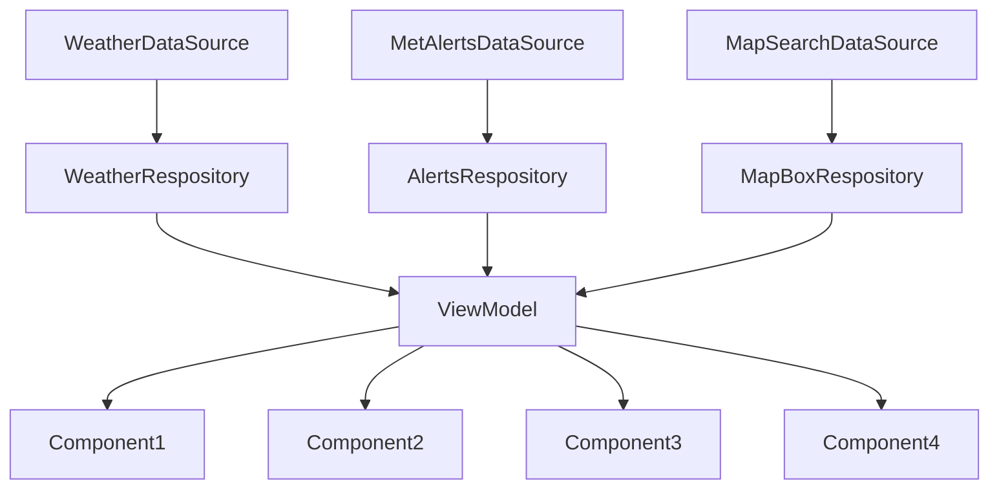

# ARCHITECTURE.MD Weather Pawcast
### ARCHITECTURE.md is a file containing information about the architecture, build and methods in the project/code. There will also be information about object-oriented principles and the chosen API-level.

## ARCHITECTURE:

## ARCHITECTURE Model


The model diagram provided is a simplified architectural representation of the weather application, highlighting key components and their relationships.

1. **Main Components and Flow**:
   - **MainActivity** acts as the main entry point, directing to various screens like **AlertScreen**, **HomeScreen**, **InformationScreen**, and **SettingsScreen**.
   - **WeatherScreen** and **WeatherViewModel** are central to handling weather-related functionalities. **WeatherViewModel** aggregates data from **MetAlertsRepository** and **LocationForecastRepository** to provide the weather and alert data.
   - **MetAlertsRepository** and **LocationForecastRepository** fetch data from respective **DataSources**, which further interact with APIs to retrieve **MetAlertData** and **LocationForecastData**.


The diagram simplifies the application's architecture by focusing on major functionalities and components like data fetching, view model operations, and UI interactions. It omits deeper details of lower-level operations or secondary UI components, focusing instead on how the main components interact and depend on each other.

For a more detailed understanding of data classes and finer architectural details, the model refers to the `MODELLING.md` file. This file in the github repo likely includes comprehensive data about class attributes, methods, and detailed relationships which are too granular for the high-level overview provided in the diagram. 

This representation is streamlined to aid quick understanding and efficient overview without overwhelming with too much detail.


### Datasource and Respositories:
We are using API calls from a JSON source from MetAlerts and MapBox. Theese are collected in DataSources. Later the data is collected by the DataRespositories using Interfaces, we have developed, to collect the data and later sort them into the Data classes. The data is called in the respositories and is used by the viewmodel. 

### ViewModel
In our App we are using a viewmodel to handle data. A ViewModel is a livedata class that calls on the respositories and save them in a UI-state. We can then handle the data, while the UI-state handles every action so the data will be updated live. This means that instead of loading the screen every time, the screen state is remembered. For example, when you set your location in the app and then change screens; if you then return to the original screen, the location will stay the same.



### Principles for Object oriented development: Coupling and Cohesion
We have tried to make our system's components more independent to achieve lower coupling. They get their info from the viewmodel and is called in the UI screen, however the components are called seperate and will thereafter fail seperate. This means that we have a low coupling system as well as high cohesion where every single component does a specified task. In the UI screen the components are called. This is a good system that makes sure that the main file does not get messy and testing each component becomes easy. If one component fails only that fails and not the enitre code.
 ```mermaid
flowchart TD
    C[DataRespository] --> D[ViewModel]
    D --> G[Component 1]
    D --> A[Component 2]
    D --> B[Component 3]
    G --> H[UI Screen]
    A --> H
    B --> H
```
#### Design Patterns
We have tried to adhere to the MVVM design pattern (Model View Viewmodel) in the development of our application. This is the design pattern that is also recommended by Google for developing apps for the Android platform. In brief, MVVM is a design pattern that helps us separate the underlying application logic from the graphical user interface. One can say that it consists in separating the app in three parts: the model, the view and the viewmodel. The view is what is actually shown on the screen. The model is the part that contains the data: data sources and repositories. The viewmodel can be said to be the bridge between the view and the model. It is responsible for receiving the data from the model, making relevant data ready for display by the view layer. 
In our application we have tried to separate these three layers. In our application code, we have a data-package (responsible for the data of the application. It contains the data sources and repositories, a ui-package, which contains the code for the graphical user interface, and a viewmodel package, which contains the code for the view model.

We have also attempted to adhere to the UDF design pattern. In few words, the UDF design pattern means that we the data should flow in only one direction, and the events which does changes to the data flows in the opposite direction, as described in Google's guide to architecture (https://developer.android.com/topic/architecture). In our app, the data is prepared in the data-package, sent to the viewmodel, and then finally made ready for the UI. However, if the user wants to for instance change location, to get weather data for an other location, that request is passed back and down to the datasource, which then again fetches new weather data based on this new location, passed back to the viewmodel, and finally prepared and ready to be displayed by the UI again.


### Solution to our operation, maintenance and further development

It is evident that prioritizing user needs and preferences is paramount in software development. Our commitment to continuous improvement ensures that our product remains dynamic and responsive to evolving user expectations.

Our application offers a comprehensive array of services designed to enhance user experience. From providing real-time weather updates to delivering targeted weather alerts through MetAlerts, our platform serves as a reliable resource for users. Recognizing the importance of engaging our primary demographic, aged 13-25, we have incorporated an informative screen tailored to their interests and requirements.

While the current version of the settings screen lays the foundation for user customization, we recognize its potential for further refinement. Our vision includes implementing universal settings, allowing users to personalize every aspect of their experience, from font sizes to imagery. Additionally, we aim to introduce a dark mode feature, catering to individuals with visual sensitivities and enhancing readability. By prioritizing accessibility, we strive to align with WCAG requirements, fostering a more inclusive and user-friendly environment.

Furthermore, we acknowledge the importance of optimizing the app for landscape mode, ensuring seamless usability across different device orientations. Our commitment to ongoing development underscores our dedication to delivering a robust and user-centric application.

The app has many comments in the code which can be of help to for example eventual new developers who want to further develop and maintain the application. Many of the comments are written in kdoc format, but we have also added comments describing what individual lines of code do, where we think it can ease the understanding of the code. In the build/documentation folder, we have also provided generated documentation (generated with the documentation engine Dokka) in both html and markdown format (akin to Javadoc for Java).

### API-level
We choose to develop the app using API-level 34, but it can run on as low a level as 28. We chose this API level as it is amongst the newer API-levels, known to be stable, and the team already have experince developing on this level.


