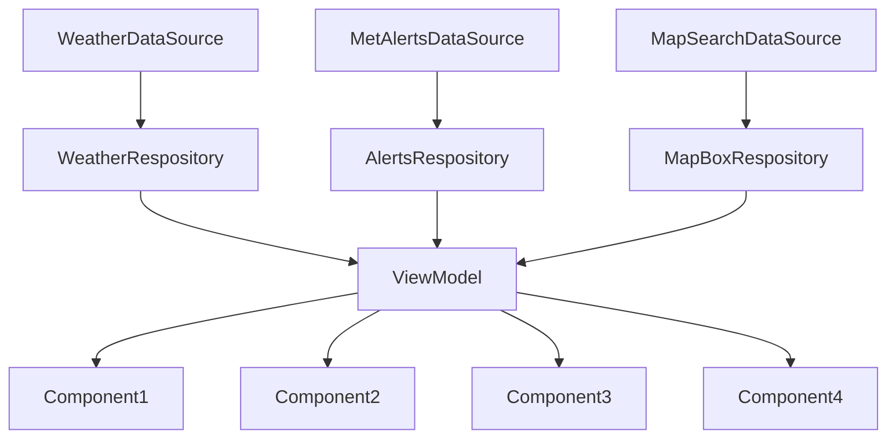

# ARCHITECTURE.MD Weather Pawcast
### ARCHITECTURE.md is a file containing information about the architecture, build and methods in the project/code. There will also be information about object-oriented principles and the chosen API-level.

## ARCHITECTURE: 
### Datasource and Respositories:
We are using API calls from a JSON source from MetAlerts and MapBox. Theese are collected in DataSources. Later the data is collected by the DataRespositories using Interfaces, we have developed, to collect the data and later sort them into the Data classes. The data is called in the respositories and is used by the viewmodel. 

### ViewModel
In our App we are using a viewmodel to handle data. A ViewModel is a livedata class that calls on the respositories and save them in a UI-state. We can then handle the data, while the UI-state handles every action so the data will be updated live. This means that instead of loading the screen every time, the screen state is remembered. For example, when you set your location in the app and then change screens; if you then return to the original screen, the location will stay the same.



### Coupling and Cohesion
We have tried to make our system's components more independent to achieve lower coupling. They get their info from the viewmodel and is called in the UI screen, however the components are called seperate and will thereafter fail seperate. This means that we have a low coupling system as well as high cohesion where every single component does a specified task. In the UI screen the components are called. This is a good system that makes sure that the main file does not get messy and testing each component becomes easy. If one component fails only that fails and not the enitre code.
 ```mermaid
flowchart TD
    C[DataRespository] --> D[ViewModel]
    D --> G[Component 1]
    D --> A[Component 2]
    D --> B[Component 3]
    G --> H[UI Screen]
    A --> H
    B --> H
```

### API-level
We choose to develop the app using API-level 34, but it can run on as low a level as 28. We chose this API level as it is amongst the newer API-levels, known to be stable, and the team already have experince developing on this level.

