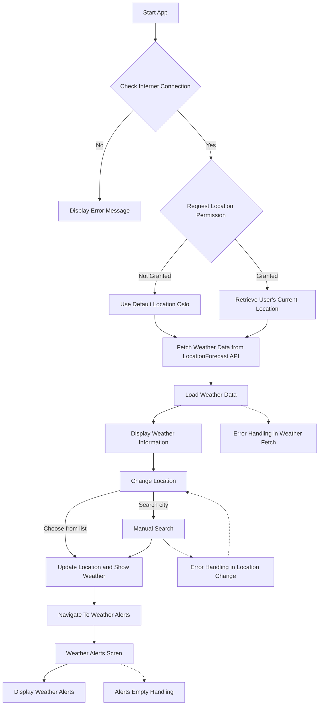
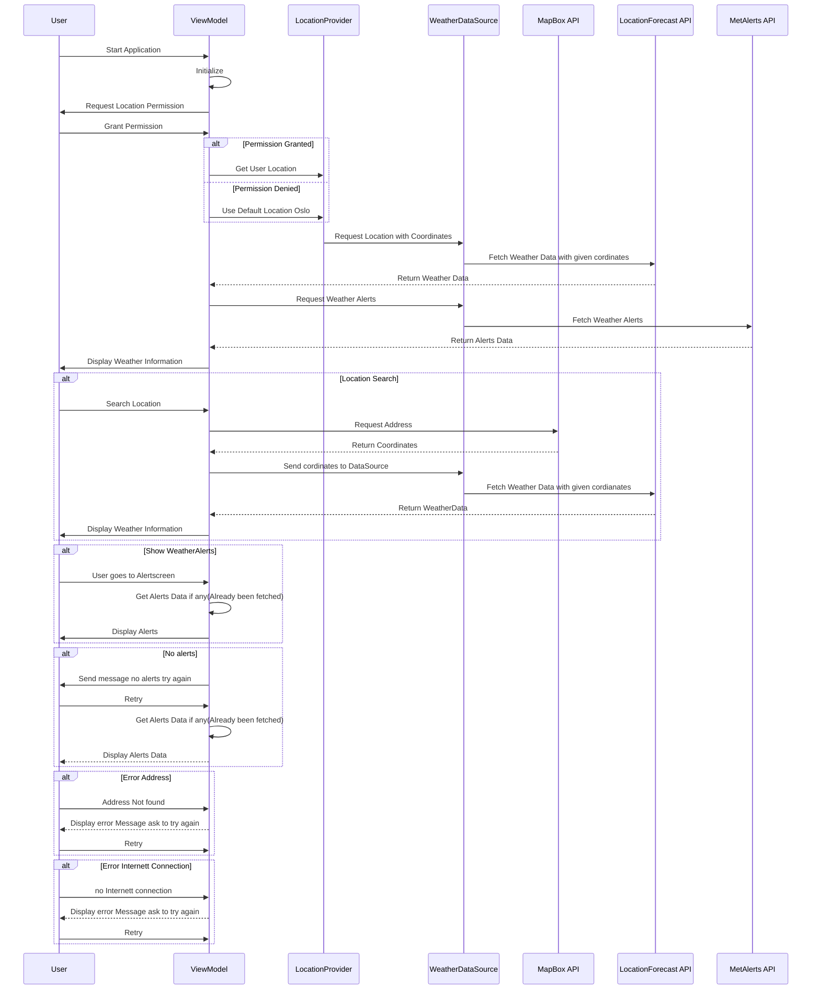

### Usecase diagram
**1. Textual Description of Use Case: Change Location**

**Name:** Change Location

**Actor:** User

**Preconditions:** None (conditions that must be in place before the use case can be executed)

**Postconditions:** Location data is updated in the system, and the user is shown weather information for the new location.

**Main Flow:**
1. The user selects to change the location through the user interface.
2. The system presents a search field where the user can enter the new location.
3. The user enters the desired location and submits the request.
4. The system uses the GeoLocation API to convert the location name to geographical coordinates.
5. The system confirms the location change and displays weather information for the new location.

**Alternative Flow: Back to Homescreen** 
2.1 If the location entered by the user does not exist, the system informs the user that the location could not be found and takes them back to the Homescreen (WeatherScreen)(This is what we meant with the extends relation between the two use cases "change location" and "back to homescreen".  
2.2 if the user denies to share user location, the system will automaticly go to Homescreen where Oslo is the standard location. 

### 2. Textual Description of Use Case: Look for Alerts in a Specific Location

**Name:** Look for Alerts in a Specific Location

**Actor:** User

**Preconditions:** The user must have chosen a valid location from a pre-defined list.

**Postconditions:** Weather alerts for the specified location are displayed to the user.

**Main Flow:**
1. The user selects the function to search for weather alerts in the user interface.
2. The user chooses a location from a pre-defined list where they want to see alerts.
3. The system retrieves geographic coordinates for the selected location via the GeoLocation API.
4. The system uses these coordinates to fetch relevant weather alerts from the MET API.
5. The system displays the weather alerts to the user.

**Alternative Flow:**
4.1 If there are no alerts for the selected location during the specified period, the system displays a message stating that no alerts have been issued for the chosen location in this period.

### 3.   Textual Description of Use Case: Look for Weather for the Next Seven Days

**Name:** Look for Weather for the Next Seven Days

**Actor:** User

**Preconditions:** The user must have selected a valid location.

**Postconditions:** A weather forecast for the next seven days is displayed.

**Main Flow:**
1. The user selects the function to view the weather forecast for the next seven days.
2. The system confirms the current location or allows the user to choose a new one.
3. The system retrieves geographic coordinates for the location via the GeoLocation API.
4. The system uses these coordinates to fetch detailed weather information for seven days from the MET API.
5. The system displays the extended weather forecast to the user.

### FlowChart: Graphical representaion of actionflow in certain use cases

The flowchart outlines the sequence of operations and decision points for our weather application. We attempt to illustrate various user scenarios (at least those we think are the most important), including location permissions, internet connectivity, and user-driven actions like changing location and viewing weather alerts. Please note that we have not attempted to strictly follow an activity diagram format, since this is not an activity diagram, but rather a custom flowchart that we have used to aid us in illustrating normal usage of the application. Here are the steps we have attempted to illustrate in our flowchart:

1. **Start App**: The application initiates when the user opens it.
   
2. **Check Internet Connection**:
   - If there is **no internet connection**, the app displays an error message indicating connectivity issues.
   - If there is an **internet connection**, the app proceeds to request location permission from the user.

3. **Request Location Permission**:
   - If **permission is not granted**, the app uses a default location, which is Oslo, to fetch weather data.
   - If **permission is granted**, the app retrieves the user's current geographic location.

4. **Fetch Weather Data**:
   - Regardless of the location sourcing method (default or user's location), the app fetches weather data from the LocationForecast API for the relevant location.

5. **Load and Display Weather Data**:
   - The app loads the fetched weather data and displays it to the user.

6. **Change Location**:
   - The user can choose to change the location for which they want weather information. They have two options:
      Choose from a list: Selects a new location from a predefined list and updates the display accordingly.
      Search address: Performs a manual search for a address. If the city is found, it updates the location and shows the weather; if not, error handling is triggered.

7. **Navigate To Weather Alerts**:
   - After updating the location, the user can navigate to a screen that displays weather alerts for all locations that METalerts have data for in Norway.

8. **Display Weather Alerts**:
   - The weather alerts screen shows relevant alerts. If no alerts are available for the location, the app handles this scenario by displaying a message. If there are no alerts at all in Norway that METalerts sends data for, then there will be a message that tells “there are no alerts for the time being, and the user will have a option to try again and if  they try again the data will be loaded again and if alerts it will show if not it will be the same message.

9. **Error Handling**:
   - **Weather Fetch**: If there's an error in fetching the weather data, the system handles this error internally.
   - **Alerts Empty Handling**: If no alerts are available for the selected location, then there will be a message that tells “there are no alerts for the time being, try again"
   - **Location Change**: If there's an error during the location change (e.g., the city searched by the user doesn't exist), the error is handled by showing a popup error message indicating that the location is not found, please try again, and will be sent back to the search section.

In the flowchart will attempt to illustrates the operational flow of our weather application: how it manages the data retrieval, user inputs, and eventual system errors that could emerge.

### SequenceDiargram
Scenario for the Change Location Function +  Show WeatherAlerts Diagram 

1. **Application Start**:
   - The user launches the weather application on their device.
   
2. **Initialization**:
   - The ViewModel initializes and sets up the necessary resources and data observers.

3. **Request for Location Permission**:
   - The ViewModel requests location permission from the user to access the device’s GPS data.

4. **User Response to Permission Request**:
   - The user grants or denies location permission.

5. **Location Data Retrieval:**
   - If granted: The ViewModel uses the LocationProvider to fetch the current location from the device's GPS.
   - If denied: The ViewModel defaults to a predefined location, such as Oslo.

6. **User Location Search (optional)**:
   - The user can search for a specific location if they wish to see weather information for a different area.
   - The user enters the location name in the search interface provided by the ViewModel.

7. **MapBox API Interaction for Location Search:**
   - The WeatherDataSource sends the search query to the MapBox API to retrieve the geographic coordinates (longitude and latitude) of the searched location.
   - The MapBox API processes the request and returns the coordinates to the ViewModel.

8. **Weather Data Fetching:**
   - The ViewModel, now equipped with precise geographic coordinates (either from the GPS or MapBox API), instructs the WeatherDataSource to request weather data.
   - The WeatherDataSource utilizes the LocationProvider to call the LocationForecast API with these coordinates.
   - The LocationForecast API returns the relevant weather data, which the LocationProvider passes back to the WeatherDataSource.

9. **Displaying Weather Information:**
   - The WeatherDataSource sends the fetched weather data to the ViewModel.
   - The ViewModel getsto be processes and formats the weather data, displaying it on the user interface for the user to view.

10. **Fetching Weather Alerts:**
    - Simultaneously, the ViewModel requests weather alerts from the MetAlerts API for the current or searched location.
    - The MetAlerts API returns the weather alerts data to the ViewModel.

11. **Displaying Weather Alerts:**
    - The ViewModel displays the weather alerts on the user interface, alerting the user to any potential weather hazards.

12. **Error Handling:**
    - If there are issues during the data fetching process (e.g., API failures, no internet connection), the ViewModel displays an error message to the user.
    - The user has the option to retry fetching the data, which triggers the ViewModel to restart the data fetching process.
 
In this scenario we attempt to illustrate the flow of user interactions from launching the application to retrieving and displaying weather data and alerts. We choose to showcase more than one usecases in this sequensediagram. Change Location and show weatherscreen. This is since we are trying to represent the relevant main functions that have generally have alot of implications and extends features.

### Class Diagram

###  Description of Class Diagram with Multiplicity

**Multiplicity Indicators**
We have used multiplicity indicators to show the relationships between classes, such as "1" --> "1" for direct one-to-one relationships, "*" --> "*" for man-to-many relationships, and "1" --> "*" for one-to-many relationships, which is particularly important for components handling multiple instances of data or features.

**Components and Their Relationships:**

1. **HomeScreen and WeatherScreen**:
   - The `HomeScreen` directly interacts with the `WeatherScreen`, having a one-to-one relationship (`"1" --> "1"`), where the `HomeScreen` controls the display of weather data through the `WeatherScreen`.

2. **AlertScreen**:
   - Connects one-to-one (`"1" --> "1"`) with the `WeatherViewModel` to fetch and display alerts. This relationship indicates that each `AlertScreen` relies entirely on a single instance of `WeatherViewModel` for its data.

3. **WeatherScreen and WeatherViewModel**:
   - Also shows a one-to-one (`"1" --> "1"`) connection, suggesting that each `WeatherScreen` is paired with a single `WeatherViewModel` to manage and display weather information.

4. **WeatherViewModel**:
   - Acts as a central node connecting various repositories and utilities. It has one-to-one (`"1" --> "1"`) relationships with `ImplementedWeatherRepository`, `MetAlertsRepository`, `LocationForecastRepositoryImpl`, and `UIComponents`, managing data flow and UI updates.

5. **Repositories and DataSources**:
   - Both `LocationForecastRepositoryImpl` and `MetAlertsRepository` maintain one-to-one (`"1" --> "1"`) relationships with their respective data sources, `LocationForecastDataSource` and `MetAlertsDataSource`, to fetch data from external APIs using `HttpClient`.

6. **ImplementedWeatherRepository and WeatherDataSource**:
   - Showcases a one-to-one (`"1" --> "1"`) relationship, with the repository managing operations like fetching current weather or extended forecasts through the `WeatherDataSource`.

7. **Utility and Data Handling Classes**:
   - `UIComponents` connects to `Utils` with a one-to-many relationship (`"*" --> "1"`), indicating multiple UI components utilize a single utility manager for various display functions.
   - `Utils` connects one-to-one (`"1" --> "1"`) with `TimeManager`, utilizing it for time-related functions.

8. **Data Structure Relationships**:
   - `WeatherDataSource` handles multiple `Features` (`"1" --> "*"`) which in turn manage geometrical data (`Geometry`) and alert properties (`PropertiesAlert`) with specific multiplicities (`"1" --> "1"` and `"1" --> "*"`, respectively).

9. **Mapping and Resource Management**:
   - `UIComponents` utilizes `MapModel` in a one-to-many relationship (`"1" --> "*"`) to display various geographical data, which aggregates multiple `MapFeatures`, further containing multiple `MapGeometry`.
   - `PropertiesAlert` links to multiple `Resources` (`"1" --> "*"`) indicating multiple resources are associated with a single alert property for external data links.

#### We have chosen not to describe the Settings and Information screen in detail here because they are more isolated classes. They do not directly interact with important parts of the application. 

